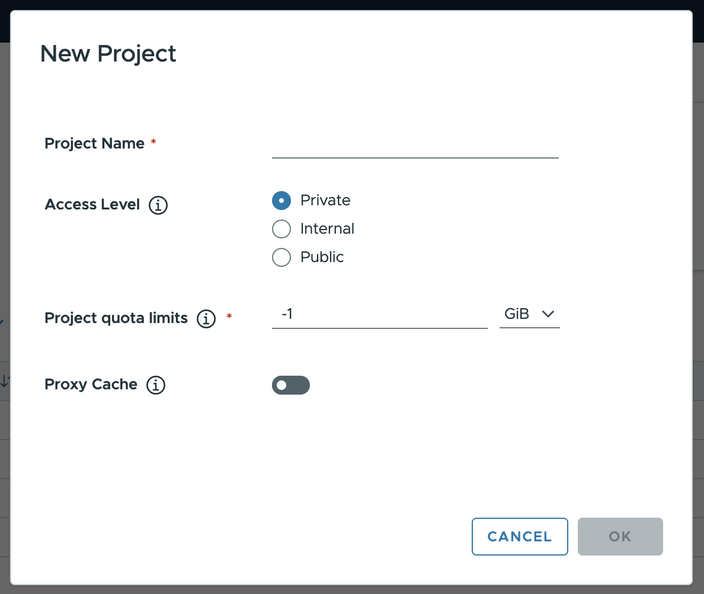
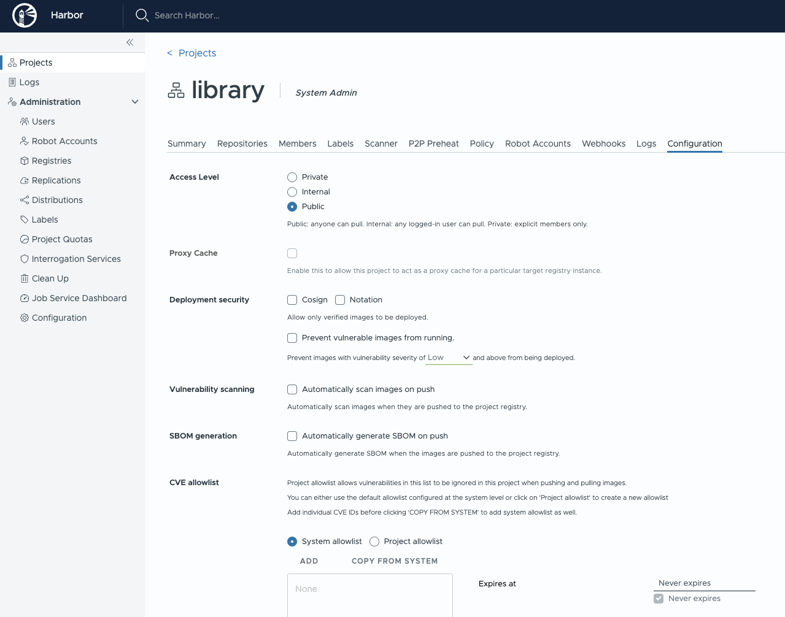

A project in Harbor contains all repositories of an application. Images cannot be pushed to Harbor before a project is created. Role-Based Access Control (RBAC) is applied to projects, so that only users with the appropriate roles can perform certain operations.

There are three access levels for a project in Harbor:

* **Private**: Only users who are members of the project can pull images.
* **Internal**: Any logged-in Harbor user can pull images from this project. Anonymous users who are not logged in are denied access, so users must run `docker login` before they can pull. This behaves like a public project but restricts access to authenticated users.
* **Public**: Any user, including anonymous users who are not logged in, can pull images from this project. This is a convenient way for you to share repositories with others.


A Harbor system administrator can also create a proxy cache project. See more about how to [Configure a Proxy Cache](../../administration/configure-proxy-cache/) project.


You create different projects to which you assign users so that they can push and pull image repositories. You also configure project-specific settings. When you first deploy Harbor, a default public project named `library` is created.

## Prerequisites

Log in to Harbor with a Harbor administrator or project administrator account.

## Procedure

1. Go to **Projects** and click **New Project**.
1. Provide a name for the project.
1. (Optional) Set the **Access Level** of the project by selecting one of the following options:

    * **Private**: Only users who are members of the project can pull images.
    * **Internal**: Any logged-in Harbor user can pull images from this project. Anonymous users are denied access, so users must run `docker login` before they can pull.
    * **Public**: Any user, including anonymous users who are not logged in, can pull images from this project.

    The access level defaults to **Private**. You can change the access level at any moment after you create the project.

    

5. Click **OK**.

After the project is created, you can browse summary, repositories, helm charts, members, labels, scanner, p2p preheat, policy, robot accounts, logs and configuration using the navigation tab.

There are two views to show repositories, list view and card view, you can switch between them by clicking the corresponding icon.

Project properties can be changed by clicking "Configuration".

* To control who can pull repositories under the project, set the **Access Level** to `Private`, `Internal`, or `Public`. Select `Public` to make all repositories accessible to everyone (including anonymous users), `Internal` to allow any logged-in Harbor user to pull, or `Private` to restrict access to project members.

* To prevent un-signed images under the project from being pulled, select the `Prevent vulnerable images from running` checkbox. For more information about content trust, see [Implementing Content Trust](../project-configuration/implementing-content-trust.md).

## Searching Projects, Repositories and Helm charts
Entering a keyword in the search field at the top lists all matching projects, repositories and helm charts. The search result includes public, internal, and private repositories you have access to.

## What to Do Next

[Assign Users to a Project](add-users.md)
